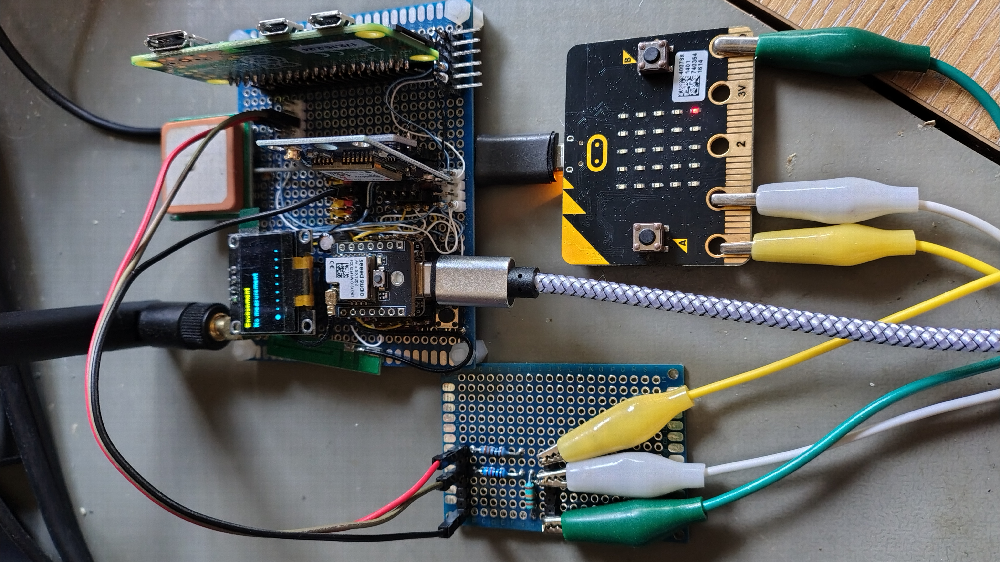

# Meshtastic-Microbit
Sending and receiving Messages using a BBC Micro:bit

This is a bit of fun to send and receive Meshtastic messages using a BBC Micro:bit.

A Micro:bit V1 is hooked up to a Seeed Studios ESP32S2 Meshtastic board mounted on a home-made dev platform.

Microbit P0 is set as Async Tx and P1 is set as async Rx, connected to the ESP32S3 Async Rx and Tx respectively, with the Meshtastic config enabling the serial interface in TEXTMSG mode.

The other link between the two boards is a common GND/0V connection. The connections are made using a small interface board that has a couple of 1K resistors in series with the signals. The resistors stop anything being damaged if misconnections are made.

The Python code for the Micro:bit sets up canned messages on the buttons which are sent when the buttons are pressed. There's also a heartbeat LED in the lower right corner of the display that confirms the code is running.

Video here: https://youtu.be/GG2j2FxR3t8
